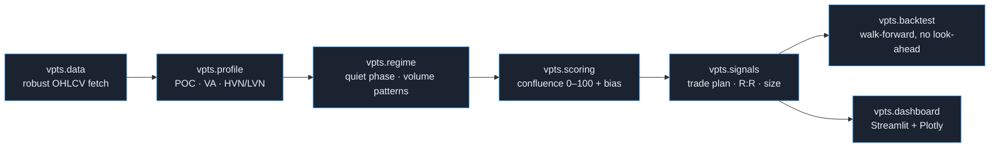
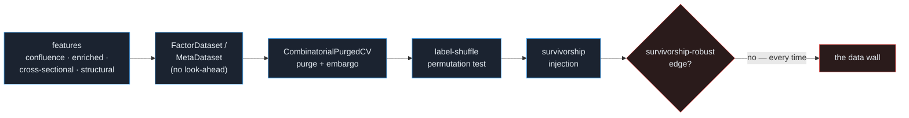
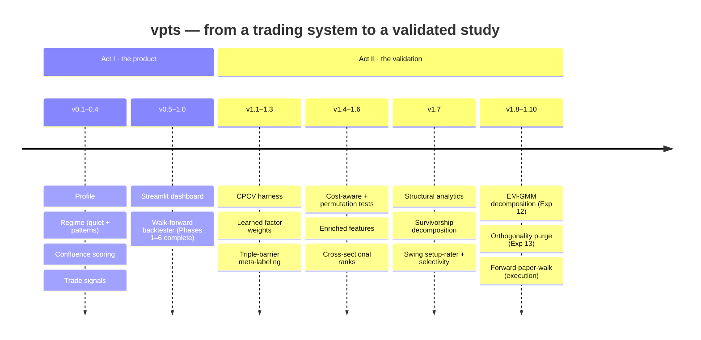

<div align="center">

# Quiet‑Volume (`vpts`)

**A free, explainable Volume‑Profile trading system — and an honest, adversarial study of whether it actually has an edge.**


</div>

`vpts` is two things in one repository:

1. **A product** — a modular, dependency‑light Volume‑Profile engine that turns raw OHLCV into an *explainable* read of the market: where institutions are active at price, whether the tape is in a quiet coil, and what a risk‑defined trade plan would look like. Six phases, all free data, all unit‑tested.
2. **A research log** — that product then put on trial. Every input was pushed through a purged combinatorial cross‑validation + permutation + survivorship harness to answer one question without flinching: **is any of this a real, out‑of‑sample, survivorship‑free edge?** The answer, across **thirteen experiments**, is documented in [**`RESEARCH.md`**](RESEARCH.md).

> **The honest headline.** No input produced a **survivorship‑robust, tradeable** edge. The strongest signal (microstructure “structure” features) is statistically real *on survivors* but is a **survivorship mirage** — it *inverts* the moment delisted names are present. The binding constraint is the **data**, not the model. This repo’s value is the *validated* findings plus a harness rigorous enough to tell a mirage from an edge.

<div align="center">

</div>

---

## Table of contents

- [Quick start](#quick-start)
- [Act I — the system (Phases 1–6)](#act-i--the-system-phases-16)
- [Act II — the validation (the research)](#act-ii--the-validation-the-research)
- [Key results, in pictures](#key-results-in-pictures)
- [Version history](#version-history)
- [Repository layout](#repository-layout)
- [Testing](#testing)
- [Scope, honesty & license](#scope-honesty--license)

---

## Quick start

```bash
pip install -r requirements.txt          # full stack (incl. dashboard)
# core only (Phases 1–4, validation, ML): pip install numpy pandas scipy yfinance
```

```python
from vpts import ConfluenceScorer, SignalGenerator, MarketDataFetcher

df = MarketDataFetcher().fetch("AAPL", period="1y", interval="1d")

score  = ConfluenceScorer().analyze(df)                 # 0–100 quality + signed bias
signal = SignalGenerator(style="reversion").analyze(df, account_equity=10_000)

print(score.summary())        # explainable confluence read of "now"
print(signal.explain())       # risk-defined plan: entry / stop / targets / R:R / size
```

Run any phase or experiment directly — every demo is a single file in [`examples/`](examples/):

```bash
python examples/phase4_demo.py AAPL 1y 1d reversion    # the product (needs internet)
python examples/structural_swing_rater.py              # the research (a swing setup-rater)
python -m pytest -q                                    # 152 offline, deterministic tests
```

---

## Act I — the system (Phases 1–6)

A clean, one‑directional pipeline. Each stage is a self‑contained module with immutable result objects and an offline test suite; each *snaps* onto the previous one.



| Phase | Module | What it does | Version |
|------:|--------|--------------|:-------:|
| **1** | [`vpts.profile`](vpts/profile) | Volume Profile — POC, Value Area (VAH/VAL), HVN/LVN; volume‑aware **auto‑binning** | `v0.1` |
| **2** | [`vpts.regime`](vpts/regime) | **Quiet‑phase** detector (percentile‑ranked vol/volume/compression) + 4 volume patterns | `v0.2` |
| **3** | [`vpts.scoring`](vpts/scoring) | **Confluence** engine → `setup_quality` 0–100 and signed `bias_score`, fully itemised | `v0.3` |
| **4** | [`vpts.signals`](vpts/signals) | Risk‑defined **trade plans** (reversion/breakout): entry, stop, targets, R:R, position size | `v0.4` |
| **5** | [`vpts.dashboard`](vpts/dashboard) | Dark **Streamlit + Plotly** app: profile overlay, quiet panel, confluence gauge, scanner | `v0.5` |
| **6** | [`vpts.backtest`](vpts/backtest) | **Walk‑forward** backtester, realistic free costs, no look‑ahead | `v1.0` |

<details>
<summary><b>Phase details</b> — the parts that matter (click to expand)</summary>

- **Profile (Phase 1).** Free OHLCV has no tick detail, so intra‑bar volume is approximated faithfully: `"uniform"` spreads each bar’s volume across `[Low, High]` and **conserves total volume exactly**. `bin_mode="auto"` sizes bins from volatility (`≈ atr_bin_fraction × ATR`) — quiet regimes get finer resolution. Results are immutable `VolumeProfile` objects (POC, VAH/VAL, HVN/LVN, `summary()`).
- **Regime (Phase 2).** The **quiet‑phase** detector blends three *self‑normalising* percentile ranks — low ATR, drying volume, Bollinger‑bandwidth compression — into a `quiet_score` with a plain‑language explanation. The pattern detector flags **dry‑up, accumulation, divergence, climax**, each anchored to a profile level (`"climax at POC 204.52"`). All indicators are dependency‑free (`vpts.regime.indicators`); `pandas-ta` is **not** required.
- **Scoring (Phase 3).** Four transparent, weighted components — value‑area location, key‑level proximity, the quiet regime (a non‑directional *quality amplifier*), and active patterns — fuse into `setup_quality` (0–100) and `bias_score` (−100…100), with `|bias| ≤ quality` by construction. Every component carries a strength, direction and one‑line reason.
- **Signals (Phase 4).** Gates on quality/bias (and optionally a quiet phase), else a reasoned `NO_TRADE`. Plans are built **from structure** (stops beyond levels or ATR multiples; targets at POC/value edges), with a minimum‑R:R filter and free fixed‑fractional sizing.
- **Dashboard (Phase 5).** Figure builders in `vpts.dashboard.charts` are **pure functions** (`go.Figure` in → out) so they unit‑test offline; `app.py` is a thin shell. Deploys free on Streamlit Community Cloud (`streamlit_app.py`).
- **Backtest (Phase 6).** At the close of bar *t*, everything is computed from a rolling window ending at *t*; fills happen at the **open of *t+1*** (cost‑adjusted). One position at a time, fixed‑fractional sizing on current equity, full blotter + equity curve. *A truth‑teller, not a money‑printer.*

Full module‑by‑module reference: [**`docs/ARCHITECTURE.md`**](docs/ARCHITECTURE.md).

</details>

---

## Act II — the validation (the research)

A green backtest is not an edge — it can be drift, compounding, or survivorship. So the second half of this project is a deliberately **adversarial** search for out‑of‑sample, survivorship‑free signal, behind one fixed methodology.



**The four bars every claim must clear** (implemented in [`vpts.validation`](vpts/validation) + [`vpts.ml`](vpts/ml)):

- **No look‑ahead.** Features at bar *t* use only data ≤ *t*; labels are strictly future. Builders are unit‑tested for it.
- **Purged + embargoed CPCV** (`CombinatorialPurgedCV`, López de Prado). Train rows whose label window overlaps a test block are *purged*; a post‑block *embargo* breaks serial‑correlation leakage. Scores are distributions over recombined OOS paths.
- **Permutation significance.** A label shuffle destroys the feature→outcome link; the p‑value is the fraction of shuffles that match/beat the real statistic. Can’t clear its own null → reported as **no edge**.
- **Survivorship stress.** The dominant confound. Synthetic *delisted* (decline‑to‑pennies) names are injected at rising rates; a real edge must survive them.

### The thirteen experiments

| # | Experiment | Headline (survivors) | Significance | Verdict |
|--:|------------|----------------------|:------------:|---------|
| 1 | Walk‑forward backtest | +14.5% | — | drift / survivorship, not validated |
| 2 | Factor ridge (confluence) | OOS IC ≈ 0 | n.s. | no edge |
| 3 | Meta‑labeling (confluence) | AUC lift on survivors | p≈0.005 → **0.80** | **survivorship** |
| 4 | Enriched per‑name features | OOS IC ≈ 0 | n.s. | no edge |
| 5 | Cross‑sectional ranks | near‑miss | underpowered | no edge |
| 6 | **Structural features** (8 nm) | IC **+0.10** | p<0.01 | real OOS correlation |
| 7 | Structural × **88 names** | IC **+0.035** | **p=0.005** | survives widening |
| 8 | Structural + survivorship | IC +0.041→+0.001 | p 0.005→0.47 | survivorship‑*sensitive* |
| 9 | Decomposition + cost | L/S **+0.26→−1.07%/bet** | — | **mirage: edge inverts** |
| 10 | Swing setup‑rater | selectivity lift +0.14%/bet | p=0.005→**0.10** | selectivity resists inversion |
| 11 | Selectivity stress‑test | robust **9/9** params | p 0.023→**0.106** | DIP‑carried, n.s. injected → closed |
| 12 | **EM‑GMM decomposition** | `gmm_gravity` IC **+0.09** | — | adds nothing — it's **price‑minus‑VWAP** (0.91‑corr, baseline wins) |
| 13 | **Orthogonality purge** | **6/23** feats clear \|IC\|≥0.05 | — | **wide but shallow**; signal = momentum/VWAP + a thin dip tail |

Full narrative, numbers and caveats: [**`RESEARCH.md`**](RESEARCH.md) · [**📄 PDF**](docs/Quiet-Volume-Research.pdf).

### Going forward — the survivorship‑free paper‑walk

Thirteen experiments named the **data** as the wall; the historical study, by construction, cannot produce *survivorship‑free* evidence. [`vpts.execution`](vpts/execution) does, forward and in paper: each day it **decides** on data ≤ today (no look‑ahead), **records** actionable calls to an append‑only ledger, and **resolves** prior calls first‑touch (next‑open fill · stop/target · time‑stop) against the bars that have since arrived. It won't manufacture an edge the backtest says is absent — it gathers clean, unbiased evidence one bar at a time. **Paper only.**

```bash
python examples/paper_walk.py --demo                              # replay the mechanism, no network
python examples/paper_walk.py --live --watchlist AAPL MSFT JPM    # one honest day — drop behind a daily cron
```

---

## Key results, in pictures

<table>
<tr>
<td width="50%">

**Survivorship mirage (experiment 9).** Traded as a long/short book that goes *flat* in the middle and bets only the conviction tails, the structural signal is profitable on survivors — then **inverts** when delisted names are injected. The bars it flags *most bullish* become the *worst* performers.

</td>
<td width="50%">

</td>
</tr>
<tr>
<td width="50%">

**Graceful decay (experiment 8).** Unlike meta‑labeling (which collapsed from p=0.005 straight to 0.80), the structural IC *degrades* under injection — surviving low, realistic delisting rates but not heavy survivorship. Categorically different, still not robust.

</td>
<td width="50%">

</td>
</tr>
<tr>
<td width="50%">

**Selectivity resists inversion (experiments 10–11).** *Which* entries are higher‑R:R (selectivity) is robust on survivors across 9/9 parameter settings (p=0.023) and uniquely doesn’t invert — but it’s carried by the same dip‑buying features and is **not significant** once delisted names are present (p=0.106).

</td>
<td width="50%">

</td>
</tr>
<tr>
<td width="50%">

**The overfitting trap (Phase C).** Reframing the target as MFE/MAE and throwing XGBoost at it changes nothing: the model *memorises* the training set (in‑sample AUC 0.943) yet scores **0.496 out‑of‑sample** — below the no‑skill line and worse than a linear baseline. Complexity is not the missing ingredient.

</td>
<td width="50%">

</td>
</tr>
</table>

---

## Version history

The repo grew in two acts — a product, then its interrogation. Full per‑version detail in [**`CHANGELOG.md`**](CHANGELOG.md).



| Version | Milestone | Adds |
|--------:|-----------|------|
| `0.1–0.5` | Phases 1–5 | profile · regime · scoring · signals · dashboard |
| `1.0` | **Product complete** | walk‑forward backtester (Phase 6) |
| `1.1` | Validation harness | `vpts.validation` — Combinatorial Purged CV |
| `1.2` | First fitted model | `vpts.ml` — ridge factor weights, CPCV‑scored |
| `1.3` | Meta‑labeling | triple‑barrier labels + secondary model |
| `1.4` | Honest scoring | cost‑aware eval + permutation significance |
| `1.5` | New inputs | enriched per‑name feature set |
| `1.6` | Equity‑alpha form | cross‑sectional rank factors |
| `1.7` | **Microstructure** | `vpts.structure` + survivorship decomposition + swing rater |
| `1.8` | EM‑GMM decomposition | parametric profile decomposition (Exp 12 — reduces to VWAP‑distance) |
| `1.9` | Orthogonality purge | feature clustering + per‑feature IC (Exp 13 — wide but shallow) |
| `1.10` | **Forward paper‑walk** | `vpts.execution` — survivorship‑free evidence, paper only |

---

## Repository layout

```
vpts/                      core library — lightweight (numpy · pandas · scipy)
├─ data/                   robust, cached OHLCV fetcher (yfinance)
├─ profile/                Phase 1 — VolumeProfileCalculator + immutable models
├─ regime/                 Phase 2 — QuietPhaseDetector + VolumePatternDetector
├─ scoring/                Phase 3 — ConfluenceScorer
├─ signals/                Phase 4 — SignalGenerator (trade plans)
├─ dashboard/              Phase 5 — pure Plotly builders + thin Streamlit app
├─ backtest/               Phase 6 — walk-forward engine, realistic costs
├─ validation/             CPCV — purged + embargoed combinatorial CV
├─ ml/                     factor model · meta-labeling · cross-sectional · enriched
├─ structure/              microstructure analytics (synthetic delta, shape, decay, EM-GMM)
└─ execution/              forward paper-walk — survivorship-free evidence (paper only)

examples/                  one runnable file per phase AND per experiment
tests/                     152 offline, deterministic tests
docs/                      ARCHITECTURE.md · img/ (committed figures + generator)
RESEARCH.md                the thirteen-experiment validation log
streamlit_app.py           dashboard entry point
```

~6.8k LOC of library, ~2.6k LOC of tests, ~2.6k LOC of runnable examples.

---

## Testing

```bash
python -m pytest -q            # 152 tests, all offline & deterministic (no network)
python tests/test_phase1.py    # or run any file directly
```

Every evaluator ships **both** a signal‑detection test (it *finds* a planted edge) **and** a null‑clearing test (it reports *no* edge on noise) — the harness is itself tested for honesty. Network‑touching code lives only in `examples/`, never in the test suite.

---

## Scope, honesty & license

- **Data.** Split/dividend‑adjusted daily OHLCV for **88 US large‑caps, 2012–2017** (the public [`stocknet‑dataset`](https://github.com/yumoxu/stocknet-dataset)). **Every name is a 2017 survivor** — the unavoidable confound the whole study is built to expose. There is no point‑in‑time / delisted data in this free source; injected delisted names are a *sensitivity estimate*, not real history.
- **Findings are research, not advice.** All results are gross‑of‑most‑costs validity checks on out‑of‑sample information content. The honest conclusion is **no survivorship‑robust tradeable edge** — the one move that could change it is point‑in‑time, delisted‑inclusive data, against which the harness is ready to re‑run all thirteen experiments immediately. Lacking that history, the **forward paper‑walk** ([`vpts.execution`](vpts/execution)) gathers survivorship‑free evidence going forward, in paper — it won't manufacture an edge, but it's the one honest way past the wall.
- **License.** MIT. *Not financial advice. For research and education.*

<div align="center">

*Built to be read by a skeptic — the deliverable is a validated conclusion and a harness you can trust, not a promise of profit.*

</div>
