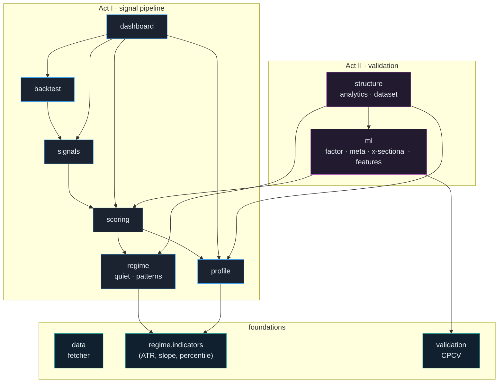

# Architecture

A module‑by‑module reference for `vpts`. For the story and findings see the [README](../README.md) and [`RESEARCH.md`](../RESEARCH.md); this document is the engineering map.

- [Design principles](#design-principles)
- [Dependency graph](#dependency-graph)
- [Act I — the signal pipeline](#act-i--the-signal-pipeline)
- [Act II — the validation stack](#act-ii--the-validation-stack)
- [Result‑object catalogue](#result-object-catalogue)
- [Extending the system](#extending-the-system)

---

## Design principles

| Principle | How it shows up |
|-----------|-----------------|
| **Dependency‑light core** | The library imports only `numpy`, `pandas`, `scipy`. Plotting/UI (`plotly`, `streamlit`) and `xgboost` are *optional extras*, imported lazily. No `pandas-ta`. |
| **Immutable results** | Every computation returns a frozen dataclass (`VolumeProfile`, `ConfluenceScore`, `TradeSignal`, `FactorCVResult`, …) with `summary()` / `as_dict()`. Inputs are never mutated. |
| **No look‑ahead, enforced** | Features at bar *t* use only data ≤ *t*; labels are strictly future. Dataset builders carry explicit unit tests asserting it. |
| **Pure functions at the edges** | Dashboard figure builders are `data → go.Figure` pure functions (unit‑tested headless); `app.py` is a thin shell. |
| **Explainability first** | Scores, signals and patterns all carry a one‑line natural‑language reason; nothing is a black box. |
| **Tested for honesty** | Each evaluator has a *signal* test (finds a planted edge) **and** a *null* test (reports nothing on noise). |

---

## Dependency graph

Internal imports only (external libs omitted). Arrows point from a module to what it depends on.

There are no import cycles: `structure` depends on `ml` (it reuses triple‑barrier labels and the `FactorDataset`/`MetaDataset` containers), never the reverse.

---

## Act I — the signal pipeline

### `vpts.data` — market data
`MarketDataFetcher.fetch(symbol, period, interval)` wraps `yfinance` with on‑disk caching, exponential‑backoff retries, and interval‑limit clamping (Yahoo serves only ~7d of 1‑minute, ~60d of intraday, etc.). Raises `NoVolumeError` for zero‑volume cash indices and `DataFetchError` on hard failures. Returns a clean OHLCV `DataFrame`.

### `vpts.profile` — Volume Profile *(Phase 1)*
`VolumeProfileCalculator(num_bins, value_area_pct, distribution, bin_mode, …).calculate(df) → VolumeProfile`.
- **POC / VAH / VAL** — point of control and the ~70% value area around it.
- **HVN / LVN** — volume peaks (support/resistance) and valleys (air pockets / targets).
- **Intra‑bar volume**: `"uniform"` spreads each bar across `[Low, High]` (conserves total volume exactly) or `"typical"` (all to `(H+L+C)/3`).
- **Auto‑binning** (`bin_mode="auto"`): bin width `≈ atr_bin_fraction × ATR`, clamped to `[min_bins, max_bins]` — finer resolution in quiet regimes. Chosen width/count recorded on `profile.extra`.

### `vpts.regime` — quiet phases & patterns *(Phase 2)*
- `indicators.py` — dependency‑free ATR, linear‑regression slope, trailing percentile rank, Bollinger bandwidth. (Replaces `pandas-ta`.)
- `QuietPhaseDetector.detect(df) → QuietPhaseResult` — blends three trailing *percentile ranks* (low ATR, drying volume, range compression) into a `quiet_score` (0–100) + `is_quiet`, with per‑bar analytics, `quiet_segments()` and a plain‑language `explanation`.
- `VolumePatternDetector.detect(df, profile=…) → VolumePatternResult` — **dry‑up, accumulation, divergence, climax**, each with a reason and (given a profile) anchored to a level.

### `vpts.scoring` — confluence *(Phase 3)*
`ConfluenceScorer().analyze(df) → ConfluenceScore` (or `.score(...)` from pre‑built parts). Four weighted, itemised components — **value‑area location, key‑level proximity, quiet regime (a non‑directional quality amplifier), active patterns** — combine into `setup_quality` (0–100) and signed `bias_score` (−100…100) with `|bias| ≤ quality`. Each `ConfluenceComponent` carries strength, direction and a reason; `summary()` renders the bar chart read‑out.

### `vpts.signals` — trade plans *(Phase 4)*
`SignalGenerator(style="reversion"|"breakout").analyze(df, account_equity) → TradeSignal`. Gates on quality/bias (± a quiet‑phase requirement) else a reasoned `NO_TRADE`. Builds entry/stop/targets **from structure** (stop beyond a level or ATR multiple; targets at POC/value edges), applies a minimum‑R:R filter, and sizes via free fixed‑fractional risk. `explain()` prints a journal‑ready write‑up.

### `vpts.backtest` — walk‑forward *(Phase 6)*
`Backtester(lookback, signal_generator, cost_model).run(df) → BacktestResult`. At each bar *t* the whole stack is computed on a rolling window ending at *t*; fills at the **open of *t+1***, all costs adverse (`CostModel`: slippage + spread + commission). One position at a time vs. its stop/targets (+ optional time stop), fixed‑fractional sizing on current equity. Returns an equity curve, full blotter, and stats (return, win rate, profit factor, max DD, expectancy, avg R, Sharpe).

### `vpts.dashboard` — Streamlit + Plotly *(Phase 5)*
`charts.py` holds pure `go.Figure` builders (price + profile overlay, quiet panel, confluence gauge, equity curve) tested headlessly; `app.py` is the interactive shell with a deep‑dive tab and a watchlist **scanner**. Entry point: `streamlit_app.py`.

---

## Act II — the validation stack

### `vpts.validation` — Combinatorial Purged CV
`CombinatorialPurgedCV(n_groups, n_test_groups, purge, embargo_pct).split(n) → list[CPCVSplit]`. The timeline is cut into `n_groups` contiguous groups; **every** combination of `n_test_groups` is held out (recombined OOS paths, not one split). Train rows whose **label window overlaps** a test block are *purged*; a trailing **embargo** removes the next `embargo_pct` of bars to kill serial‑correlation leakage. `purge` is set to the label horizon by the dataset builders.

### `vpts.ml` — the fitted models & their evaluation
| File | Provides |
|------|----------|
| `models.py` | `FactorDataset`, `MetaDataset`, `CrossSectionalPanel` (immutable, no‑look‑ahead containers) + every `…CVResult` / `…PermutationResult` / `FactorBucketResult`. |
| `factor_model.py` | `RidgeFactorModel` (numpy ridge, train‑only standardisation) · `cpcv_factor_eval` (OOS IC, dir‑acc, L/S) · `cpcv_factor_quantile_returns` (**long/short/flat conviction buckets**) · `permutation_test_factor`. |
| `meta_model.py` | `LogisticMetaModel` · `cpcv_meta_eval` (precision/AUC/return‑lift; `threshold` **or** relative `select_top`) · `permutation_test_meta`. |
| `labeling.py` | `triple_barrier_labels` (first‑touch profit/stop/vertical = MFE/MAE outcome) + `build_meta_dataset`. |
| `features.py` | `build_enriched_factor_dataset` — richer per‑name inputs beyond the four coarse confluence factors. |
| `cross_sectional.py` | `build_cross_sectional_panel` + `cross_sectional_ic_eval` — the standard equity‑alpha rank‑factor construction, scored **within‑date**. |

**Evaluation contract.** A factor evaluator reports the distribution of **out‑of‑sample IC** across CPCV paths plus a costless long/short return; a meta evaluator reports **precision / AUC / per‑trade return lift** of filtered vs. all signals. Significance is always a **label‑shuffle permutation p‑value**.

### `vpts.structure` — microstructure analytics *(the strongest signal)*
| File | Provides |
|------|----------|
| `analytics.py` | Synthetic delta (CLV×volume), profile **skew/kurtosis**, **P/b/B/D** shape classification, ledges, poor highs, value‑area‑compression z‑score, time‑decayed **cost‑basis migration**. |
| `dataset.py` | `_walk_structural` (one shared no‑look‑ahead bar walk) feeding `build_structural_dataset` → `FactorDataset` (forward return) and `build_structural_meta_dataset` → `MetaDataset` (**MFE/MAE triple‑barrier** win/loss for a fixed‑side bet; also records `holding_bars` — entry→first‑touch exit ≤ the **max holding period** — exposed as `mean_holding` / `pct_capped`). |
| `models.py` | `StructuralFeatures` row + the canonical 13‑feature ordering (`STRUCTURAL_FEATURES`). |

These 13 features feed the same harness as everything else. Their two feature families recur in the findings: **REGIME** (vacr_z, POC slope, shape, footprints) vs. **DIP** (synthetic delta, POC location, cost‑basis migration) — the decomposition (experiment 9–11) shows the signal lives in the *survivorship‑prone DIP family*.

---

## Result‑object catalogue

Every public computation returns one of these frozen dataclasses (all with `summary()` and most with `as_dict()`):

| Object | From | Carries |
|--------|------|---------|
| `VolumeProfile` / `VolumeNode` | `profile` | POC, VAH/VAL, HVN/LVN, bins, `extra` |
| `QuietPhaseResult` / `QuietState` | `regime.quiet` | `quiet_score`, `is_quiet`, segments, explanation |
| `VolumePatternResult` / `VolumePattern` | `regime.patterns` | pattern type, strength, anchored reason |
| `ConfluenceScore` / `ConfluenceComponent` | `scoring` | `setup_quality`, `bias_score`, itemised components |
| `TradeSignal` | `signals` | action, entry/stop/targets, R:R, size, `explain()` |
| `BacktestResult` / `Trade` / `CostModel` | `backtest` | equity curve, blotter, stats |
| `CPCVSplit` | `validation` | train/test indices per recombined path |
| `FactorCVResult` / `FactorBucketResult` / `FactorPermutationResult` | `ml.factor_model` | OOS IC, weights, conviction‑bucket returns, p‑value |
| `MetaCVResult` / `MetaPermutationResult` | `ml.meta_model` | precision/AUC, return lift, `select_top`, p‑value |
| `CrossSectionalICResult` | `ml.cross_sectional` | within‑date IC distribution, p‑value |
| `StructuralFeatures` | `structure` | the 13 structural features for one bar |

---

## Extending the system

- **A new feature family?** Build a `FactorDataset` (features → forward return) or `MetaDataset` (features → triple‑barrier win) with no look‑ahead, then call `cpcv_factor_eval` / `cpcv_meta_eval` + the matching `permutation_test_*`. The bars are the same for everyone.
- **A new model?** Match the evaluation contract (OOS IC or precision/return‑lift over CPCV paths) so results are comparable; keep `fit`/`predict` numpy‑only where possible.
- **Before believing any positive**, run it through the survivorship injection (`examples/structural_survivorship.py`, `examples/structural_selectivity.py`) — that is where every promising signal in this repo has died.
